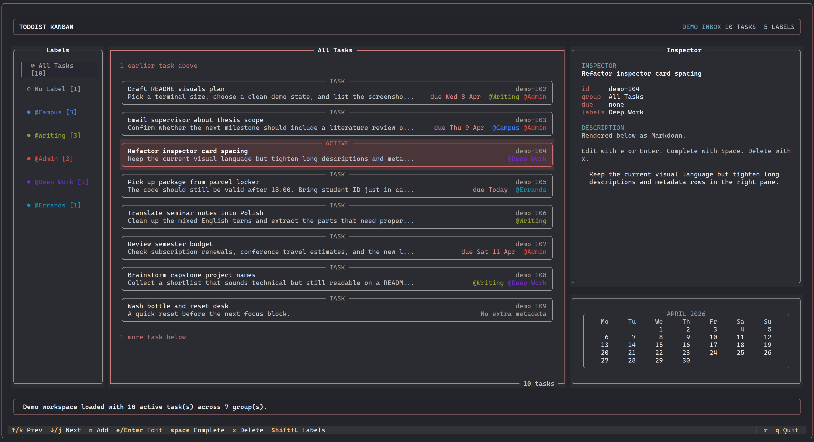

# Todoist Kanban TUI

A Textual-based Todoist client with a keyboard-first kanban feel.

## Disclaimer

This is an independent project built on top of the Todoist API. It is not affiliated with, endorsed by, or maintained by the Todoist team.

## Preview



## What It Does

- Loads active tasks from your Todoist Inbox
- Groups tasks in a left sidebar by labels, with dedicated views for `All Tasks` and `No Label`
- Uses a 3-pane layout: label groups, task list, and inspector
- Opens task creation/editing in a centered popup instead of a permanent editor pane
- Opens label creation/editing/deletion in a dedicated popup manager
- Runs with mouse support disabled

## Run

Set your Todoist API token first:

```bash
export TODOIST_API_TOKEN="your-token"
```

Then start the app with either:

```bash
uv run python main.py
```

or:

```bash
uv run todoist-tui
```

If no token is configured, the app starts in a built-in read-only demo mode with sample tasks and labels. That makes it easy to capture screenshots without connecting to Todoist.

## Install

Install the published CLI with:

```bash
uv tool install todoist-tui
```

Then run:

```bash
todoist-tui
```

If the package name on PyPI ends up needing to change because `todoist-tui` is already taken, update the command above to match the published name.

## Keyboard

Main screen pane movement:

- `Tab` / `Shift+Tab`: cycle between `Labels`, `Tasks`, and `Inspector`
- `Left` / `Right`: move between the 3 main panes
- `Esc`: return focus to the task list pane

Main screen navigation inside the active pane:

- `j` / `k` or `Down` / `Up`
  - in `Labels`: move between label groups
  - in `Tasks`: move between tasks in the current group
  - in `Inspector`: scroll the inspector

Main screen actions:

- `n`: create a new task
- `e` or `Enter`: edit the selected task
- `Space`: complete the selected task
- `x`: delete the selected task
- `Shift+L` (`L`): open label management
- `r`: refresh from Todoist
- `q`: quit

Inside task and label popups:

- `Ctrl+S`: save
- `Esc`: cancel

Inside task create/edit:

- `Content`, `Labels`, and `Due` start with the caret at the end of the existing text
- `Description` starts with the caret at the end and does not auto-select the current line
- Label entry supports autocomplete for existing Todoist labels

Inside the label manager popup:

- `j` / `k`: move between labels
- `a`: create a label
- `e` or `Enter`: edit the selected label
- `x`: delete the selected label
- `Esc` or `q`: close

## Optional Configuration

- `TODOIST_DUE_LANG` sets the parsing language for due date text, for example `en` or `pl`
- You can also pass `--token` and `--due-lang` on the command line

## Release

Build the distribution files:

```bash
uv build
```

Upload them to PyPI with `twine`:

```bash
uv tool install twine
twine upload dist/*
```

The `todoist-tui` project name in [pyproject.toml](./pyproject.toml) should be treated as the intended publish name. Check that it is still available on PyPI before the first release. If it is already taken, rename the project there before uploading.

## Notes

- New tasks are always created in the Inbox project Todoist marks as your Inbox
- Tasks with multiple labels can appear in multiple label groups
- Labels are shown as a lightweight left-hand navigation rail rather than boxed chips
- Leaving the due field blank while editing a task removes its existing due date
